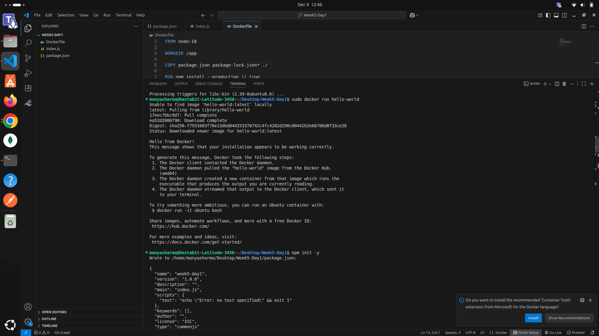
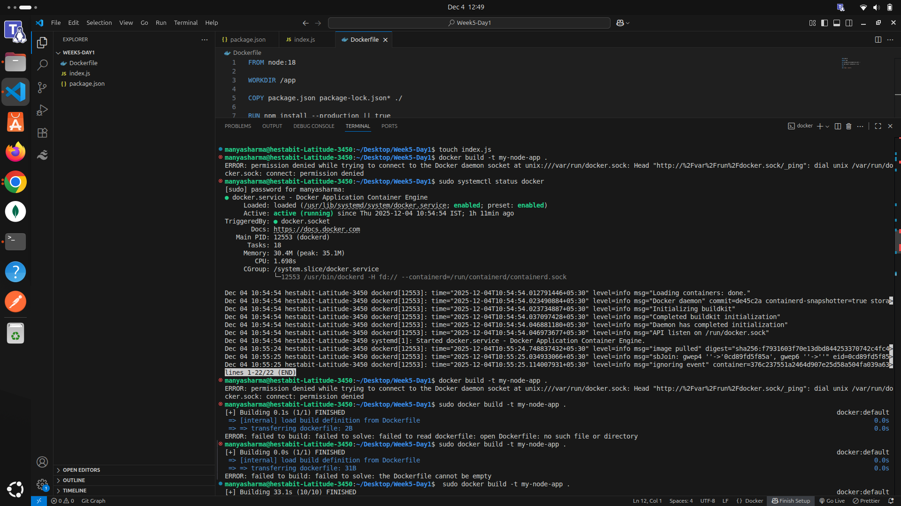
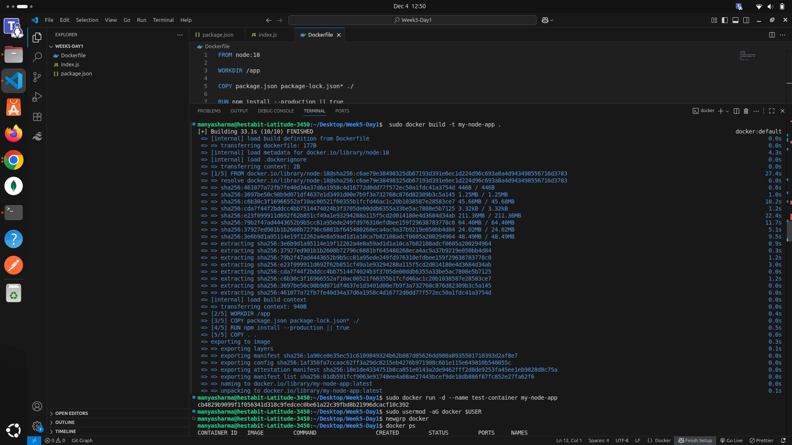
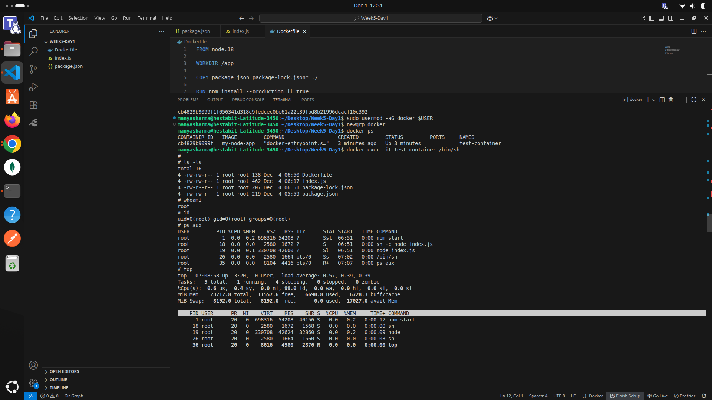
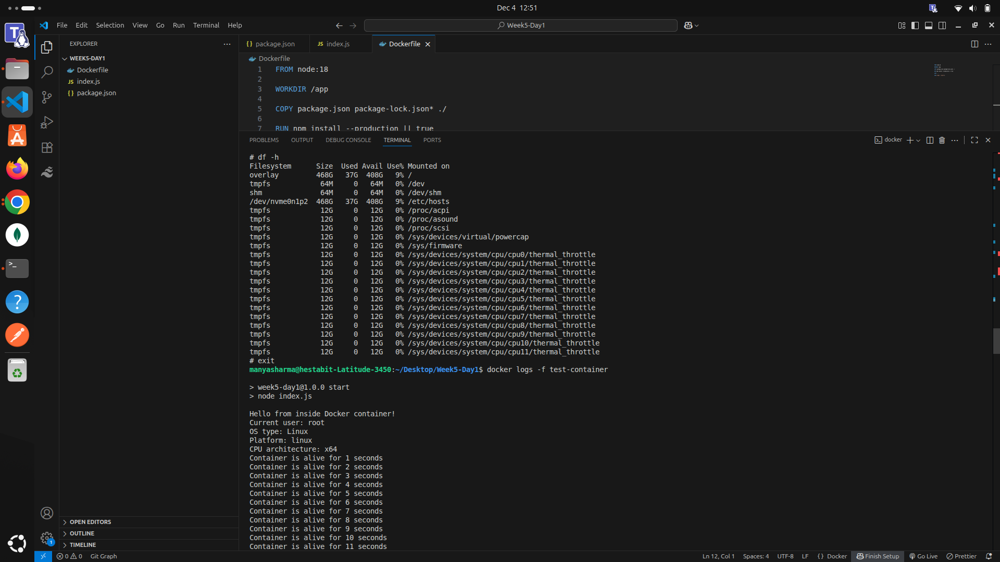
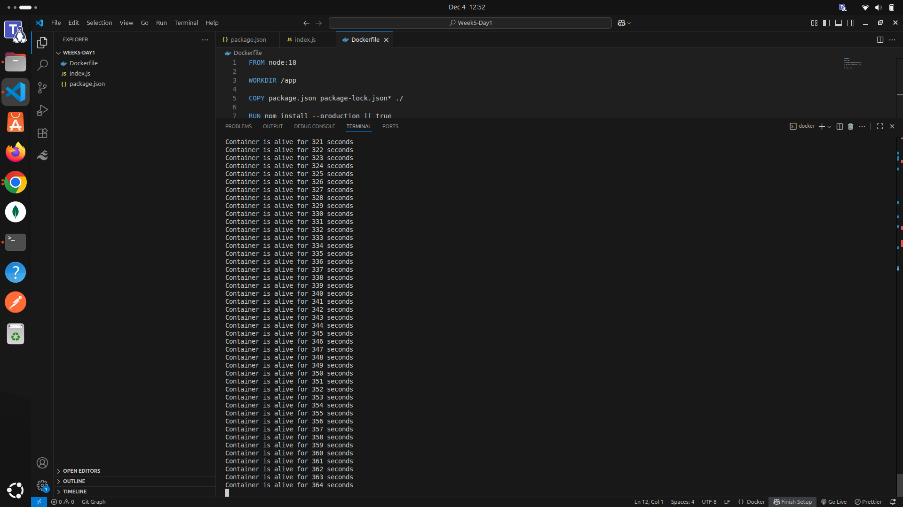
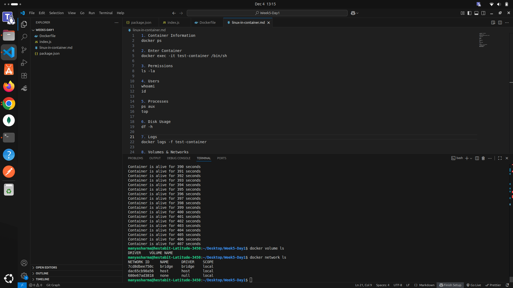

1. Container Information
docker ps

2. Enter Container
docker exec -it test-container /bin/sh

3. Permissions 
ls -la

4. Users 
whoami
id

5. Processes 
ps aux
top

6. Disk Usage 
df -h

7. Logs 
docker logs -f test-container

8. Volumes & Networks 
docker volume ls
docker network ls

